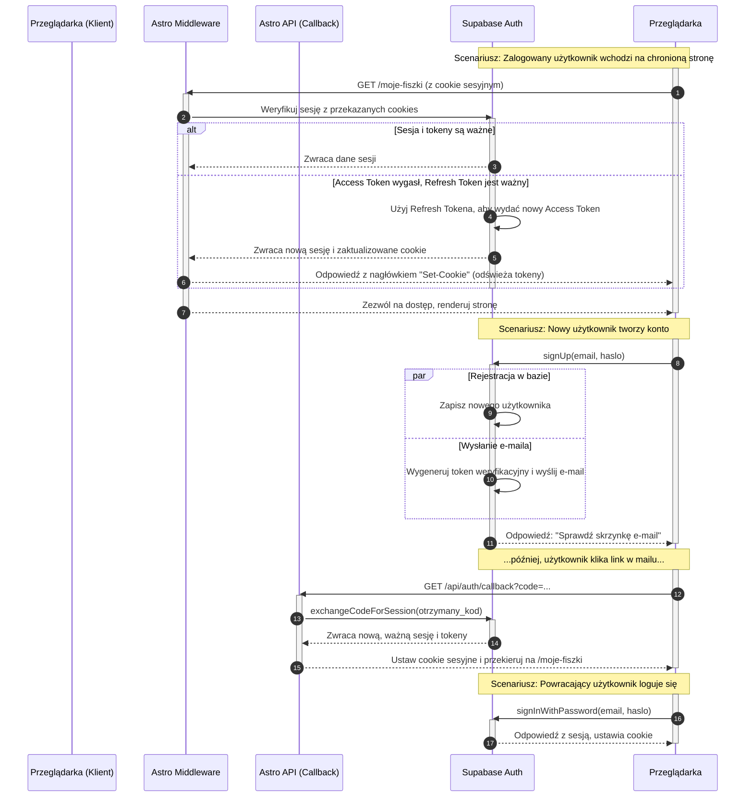

### 1. Aktorzy i ich role

W procesie autentykacji biorą udział cztery główne strony (aktorzy):

1.  **Przeglądarka (Klient)**: Reprezentuje interfejs użytkownika (komponenty React), z którym wchodzi w interakcję użytkownik. Przechowuje tokeny w bezpiecznych ciasteczkach `HttpOnly` i inicjuje żądania.
2.  **Astro Middleware**: Działa jako serwerowa "bramka" dla żądań przychodzących do aplikacji. Jest pierwszą linią obrony – weryfikuje sesję użytkownika przy każdej nawigacji po stronie renderowanej na serwerze.
3.  **Astro API (`/api/auth/callback`)**: Specjalistyczny, serwerowy punkt końcowy, którego jedynym zadaniem jest bezpieczna wymiana kodu autoryzacyjnego (otrzymanego w linku e-mail) na pełnoprawną sesję użytkownika.
4.  **Supabase Auth**: Zewnętrzna usługa, która działa jako "źródło prawdy" (source of truth) w kwestii tożsamości. Zarządza danymi użytkowników, hasłami, generuje i weryfikuje tokeny JWT oraz obsługuje wysyłkę e-maili transakcyjnych (np. weryfikacyjnych).

### 2. Przepływy autentykacji

Zidentyfikowałem trzy kluczowe przepływy, które muszą zostać zwizualizowane:

1.  **Dostęp do strony chronionej i odświeżanie sesji**: Pokazuje, jak `Middleware` chroni zasoby i jak biblioteka `@supabase/ssr` w tle, w sposób niewidoczny dla użytkownika, odświeża wygasające tokeny dostępowe, zapewniając ciągłość sesji.
2.  **Rejestracja i weryfikacja przez e-mail**: Ilustruje, jak użytkownik tworzy konto, a następnie finalizuje proces, klikając w link weryfikacyjny, co uruchamia bezpieczny przepływ po stronie serwera przez `Astro API`.
3.  **Logowanie i wylogowanie**: Klasyczny proces, w którym użytkownik podaje poświadczenia, a w odpowiedzi otrzymuje ciasteczka sesyjne. Pokazany zostanie również proces czyszczenia sesji podczas wylogowania.

### 3. Proces weryfikacji i odświeżania tokenów

- **Tokeny**: Supabase używa pary tokenów:
  - **Access Token (JWT)**: Krótkożyjący (np. 1 godzina), używany do autoryzacji żądań.
  - **Refresh Token**: Długożyjący, bezpiecznie przechowywany i używany wyłącznie do uzyskania nowego Access Tokena.
- **Weryfikacja**: `Middleware` przy każdym żądaniu przekazuje ciasteczka do serwerowego klienta Supabase. Klient weryfikuje sygnaturę i datę ważności Access Tokena.
- **Odświeżanie**: Jeśli Access Token wygasł, ale Refresh Token jest wciąż ważny, serwerowy klient Supabase automatycznie używa go do uzyskania nowej pary tokenów od `Supabase Auth`. Następnie aktualizuje ciasteczka w odpowiedzi do przeglądarki. Ten proces jest kluczowy dla bezpieczeństwa i wygody użytkowania.

