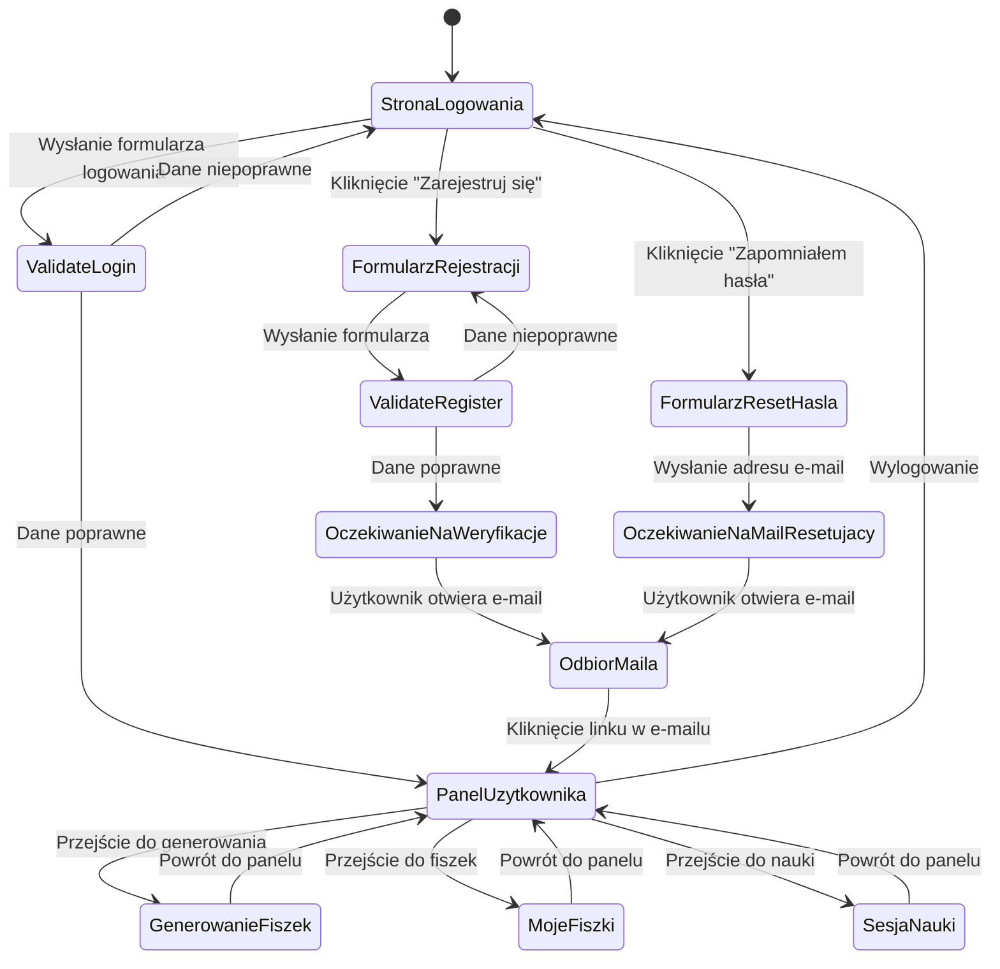

### 1. Lista ścieżek użytkownika

Na podstawie dokumentu `@prd.md` (historyjki US-001, US-002), zidentyfikowałem następujące kluczowe podróże użytkownika:

1.  **Ścieżka nowego użytkownika (Rejestracja):**

    - Użytkownik trafia do aplikacji i chce założyć konto.
    - Przechodzi na stronę rejestracji.
    - Wypełnia formularz (e-mail, hasło).
    - Otrzymuje informację o konieczności weryfikacji adresu e-mail.
    - Odbiera e-mail i klika w link aktywacyjny.
    - Zostaje przekierowany do aplikacji jako zalogowany użytkownik.

2.  **Ścieżka powracającego użytkownika (Logowanie):**

    - Użytkownik wchodzi do aplikacji i chce się zalogować.
    - Przechodzi na stronę logowania.
    - Wpisuje swoje dane.
    - Po pomyślnym logowaniu uzyskuje dostęp do funkcji aplikacji (np. generowania fiszek).

3.  **Ścieżka wylogowania:**

    - Zalogowany użytkownik klika przycisk "Wyloguj".
    - Zostaje przeniesiony do stanu "niezalogowany" (np. na stronę logowania).

4.  **Ścieżka odzyskiwania hasła:**

    - Użytkownik na stronie logowania zdaje sobie sprawę, że nie pamięta hasła.
    - Klika link "Zapomniałem hasła".
    - Wpisuje swój adres e-mail, aby otrzymać link do resetu.
    - Klika w link otrzymany w wiadomości e-mail.
    - Ustawia nowe hasło w dedykowanym formularzu.
    - Może teraz zalogować się przy użyciu nowego hasła.

5.  **Ścieżka dostępu do zasobów chronionych:**
    - Niezalogowany użytkownik próbuje uzyskać bezpośredni dostęp do strony wymagającej logowania (np. "Moje fiszki").
    - System automatycznie przekierowuje go na stronę logowania.

### 2. Główne podróże i stany

- **Podróż "Niezalogowany"**: Obejmuje wszystkie interakcje użytkownika, który nie ma aktywnej sesji. Stanem początkowym jest zazwyczaj strona logowania lub rejestracji.
- **Podróż "Zalogowany"**: Obejmuje wszystkie działania użytkownika po pomyślnej autentykacji, takie jak korzystanie z głównych funkcji aplikacji.
- **Podróż "Autentykacja"**: To proces przejściowy, który obejmuje stany pośrednie, takie jak wypełnianie formularzy, walidacja danych i oczekiwanie na potwierdzenie e-mail.

### 3. Punkty decyzyjne i alternatywne ścieżki

- **Na stronie logowania**: Użytkownik może: a) zalogować się, b) przejść do rejestracji, c) przejść do odzyskiwania hasła.
- **Walidacja formularza (logowanie/rejestracja)**: a) Dane poprawne -> kontynuuj przepływ, b) Dane niepoprawne -> pokaż błąd, pozostań w formularzu.
- **Dostęp do chronionej strony**: a) Zalogowany -> pokaż stronę, b) Niezalogowany -> przekieruj do logowania.

### 4. Cel każdego stanu

- **Strona Logowania**: Umożliwienie powrotu do aplikacji, stanowi centrum nawigacyjne dla niezalogowanego użytkownika.
- **Formularz Rejestracji**: Zebranie niezbędnych danych do utworzenia nowego konta.
- **Oczekiwanie na weryfikację**: Poinformowanie użytkownika o kolejnym kroku (sprawdzenie skrzynki e-mail) i zabezpieczenie przed niezweryfikowanymi kontami.
- **Panel Użytkownika / Główne Funkcje**: Stan docelowy, w którym użytkownik realizuje cel, dla którego korzysta z aplikacji (np. nauka, tworzenie fiszek).
- **Formularz Odzyskiwania Hasła**: Umożliwienie użytkownikowi odzyskania dostępu do konta w bezpieczny sposób.

