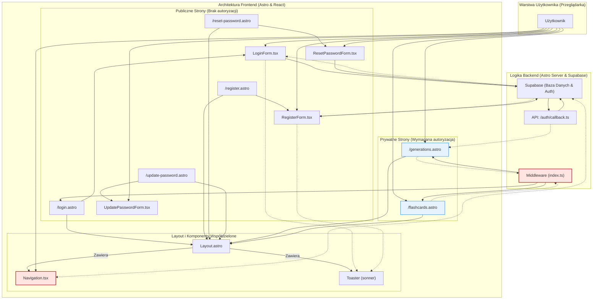

### 1. Lista Komponentów i Stron

Na podstawie analizy `@auth-spec.md`, `@prd.md` oraz struktury projektu, zidentyfikowałem następujące elementy, które wezmą udział w procesie autentykacji:

**Istniejące elementy do modyfikacji:**

- **`src/layouts/Layout.astro`**: Główny layout aplikacji. Nie wymaga bezpośrednich zmian w logice, ale jest kontenerem dla wszystkich stron i komponentu nawigacji.
- **`src/components/Navigation.tsx`**: (do weryfikacji, czy istnieje, ale zakładam, że tak na podstawie specyfikacji) Kluczowy komponent React, który zostanie zaktualizowany, aby dynamicznie renderować linki ("Zaloguj", "Zarejestruj się" vs "Moje Fiszki", "Wyloguj") w zależności od stanu zalogowania użytkownika.
- **Strony chronione (np. `/generations`, `/flashcards`)**: Istniejące strony, które staną się niedostępne dla niezalogowanych użytkowników dzięki nowemu middleware.

**Nowe Strony (Astro):**

- **`src/pages/login.astro`**: Publiczna strona renderująca formularz logowania.
- **`src/pages/register.astro`**: Publiczna strona renderująca formularz rejestracji.
- **`src/pages/reset-password.astro`**: Publiczna strona do inicjowania resetu hasła.
- **`src/pages/update-password.astro`**: Strona do ustawiania nowego hasła po kliknięciu w link z e-maila.

**Nowe Komponenty (React - w `src/components/auth/`):**

- **`LoginForm.tsx`**: Interaktywny formularz logowania (email, hasło).
- **`RegisterForm.tsx`**: Interaktywny formularz rejestracji (email, hasło).
- **`ResetPasswordForm.tsx`**: Formularz do wpisania adresu e-mail w celu resetu hasła.
- **`UpdatePasswordForm.tsx`**: Formularz do wprowadzenia nowego hasła.

**Komponenty Współdzielone i Logika:**

- **`src/middleware/index.ts`**: Logika serwerowa przechwytująca wszystkie żądania, sprawdzająca sesję i chroniąca trasy.
- **`src/db/supabase.ts`**: Moduł do tworzenia klientów Supabase (po stronie serwera i klienta).
- **`Toaster` (z `sonner`)**: Istniejący komponent do wyświetlania globalnych powiadomień (np. "Zalogowano pomyślnie").

### 2. Główne Strony i ich Komponenty

- **Publiczne Strony (`/login`, `/register`, etc.)**:
  - Każda strona `.astro` będzie osadzona w głównym `Layout.astro`.
  - `Layout.astro` będzie zawierał (zmodyfikowany) `Navigation.tsx`.
  - Strona `.astro` będzie renderować odpowiedni komponent formularza React (np. `login.astro` -> `LoginForm.tsx`).
- **Prywatne Strony (`/generations`, `/flashcards`, etc.)**:
  - Będą chronione przez `middleware`.
  - Również będą osadzone w `Layout.astro` z `Navigation.tsx` (który pokaże stan zalogowanego użytkownika).

### 3. Przepływ Danych i Interakcji Użytkownika

1.  Użytkownik wchodzi na stronę, np. `/generations`.
2.  `middleware/index.ts` przechwytuje żądanie. Sprawdza sesję Supabase.
3.  **Jeśli użytkownik jest niezalogowany**, middleware przekierowuje go na stronę `/login`.
4.  Strona `login.astro` jest renderowana. Wewnątrz niej `Layout.astro` renderuje `Navigation.tsx` w stanie "niezalogowany". `login.astro` renderuje komponent `LoginForm.tsx`.
5.  Użytkownik wypełnia formularz w `LoginForm.tsx`. Komponent komunikuje się z Supabase po stronie klienta, aby zalogować użytkownika.
6.  Po pomyślnym zalogowaniu, `LoginForm.tsx` przekierowuje użytkownika na `/generations`.
7.  Stan autentykacji w `Navigation.tsx` jest aktualizowany (przez hook `onAuthStateChange`), pokazując linki dla zalogowanego użytkownika.
8.  **Jeśli użytkownik jest zalogowany** (krok 3), `middleware` pozwala na dostęp do `/generations`. Strona jest renderowana normalnie, a `Navigation.tsx` od razu pokazuje stan "zalogowany".

### 4. Funkcjonalność Komponentów

- **`Layout.astro`**: Zapewnia spójną strukturę HTML, tło i ogólny wygląd dla wszystkich podstron.
- **`Navigation.tsx` (zaktualizowany)**: Odpowiada za nawigację. Jego zawartość zależy od stanu zalogowania pobranego z Supabase.
- **Formularze React (`LoginForm`, etc.)**: Zarządzają stanem pól, walidacją po stronie klienta (z `zod`) i komunikacją z API Supabase Auth.
- **Strony Astro (`login.astro`, etc.)**: Działają jako "klej" - integrują layout, nawigację i odpowiednie komponenty React w jedną całość.
- **`middleware/index.ts`**: Działa jako strażnik (guard), chroniąc strony i udostępniając dane sesji w `Astro.locals`.

